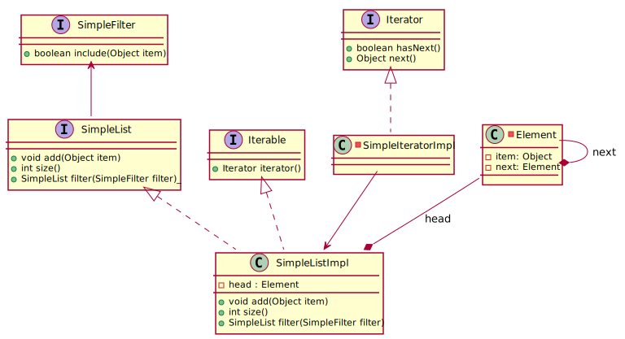

_This is an assignment to the [Software Architecture](https://ohm-softa.github.io) class at the [Technische Hochschule Nürnberg](http://www.th-nuernberg.de)._

# Assignment 2: Classes and interfaces revisited

In this assignment we'll be looking at 
- static and regular inner classes
- anonymous classes
- lambda expressions and `@FunctionalInterface`
by implementing a basic linked list.

A linked list consists of a _controller_ (the _list_ class) and elements that contain the actual payload (the _container_ or _element_ class).
The controller class maintains a reference to the first list element (`head`), and every element points to its successor (or to a `null` value, if it's the last).
The following UML shows all classes of this assignment (including the interfaces `java.util.Iterator<T>` and `java.lang.Iterable<T>`; we'll cover ).

_Note: the concept of an iterator will be discussed in detail in a few weeks._

## Setup

1. Create a fork of this repository.
2. Clone your fork to get a local working copy.
3. Import the project to your IDE (choose _Gradle project_)

## Static and regular inner classes

1. [What is a static class?](http://lmgtfy.com/?q=java+static+inner+class)
	- Refresh your knowledge on UML (_e.g._ [here](http://plantuml.com/class-diagram))
	- What's the difference between a regular inner and static inner class?
	- Can you think of some use cases for both?
2. Implement `Element` as static inner class of `SimpleListImpl`.
	- Why is this class static, and ideally `private`?
3. Implement the `Iterator` interface as inner class of `SimpleListImpl`.
	- Why is it helpful to make this class non-static?
4. Add the `Iterable` interface to your `SimpleListImpl`, and implement the required methods.
	- Why is implementing the `Iterable` interface essential for a (good) list implementation? (Hint: Check the test cases!)
	- Are there any language definition constraints to this?

## Anonymous (inner) classes and lambda expressions

1. Implement the `filter` method for your `SimpleListImpl` class (see `SimpleFilter` interface).
2. Check the given test suite for an example on 
	- how to use an anonymous class with an interface.
	- how an anonymous class can be replaced by a lambda expression.
3. Add some test methods and implement another filter logic (_e.g._ every third number, or any number smaller than a certain value).
5. Review anonymous classes and lambdas.
	- Lambda expressions look very convenient; can you think of a scenario where they should not be used?
	- Recall how scoping works for anonymous (inner or local) classes; can you think of a scenario where to avoid them?
