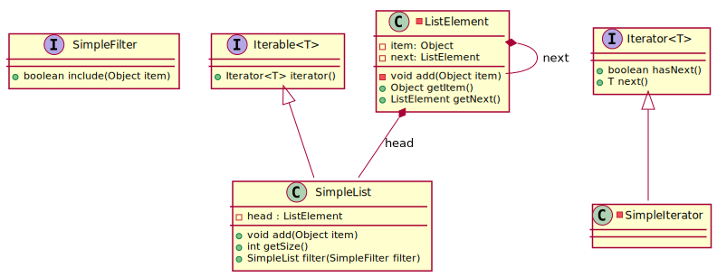

# Assignment 2: Classes and interfaces revisited

Topics of this assignment:

1. static nested classes
2. nested classes
3. anonymous classes
4. lambda expressions
4. `@FunctionalInterface`

To get the concepts of this assignment we're going to implement a simple linked list.
A linked list is consists of elements where every element points to its successor or to a `NULL` value.
The following UML shows all classes of this exercise (including the JDK interfaces `Iterator<T>` and `Iterable<T>`).

_Side note: the concept of an iterator will be discussed in a view weeks - for now you will just implement one_

## Setup

1. Create a fork of this repository.
2. Clone your fork to get a local working copy.
3. Import the project to your IDE.

## Static nested classes

1. [What is a static class?](http://lmgtfy.com/?q=java+static+inner+class)
2. Implement the static class `ListElement` inside of `SimpleList`.
3. Why is this class static (and optimally `private`)?

## Nested classes

1. What's the difference between a nested and a nested static class? Think of some use cases for both.
2. Implement the `Iterator` interface inside of `SimpleList` as nested class.
3. Implement the `Iterable` interface for your `SimpleList`.
4. Search the [internet](https://www.google.com) to understand why the `Iterable` interface is essentially for a list implementation.

## Anonymous classes and lambda expressions

1. Implement the `filter` method for your `SimpleList` class (have a look at the `SimpleFilter` interface).
2. Check the given test suite for an example how a anonymous class can be used with an interface.
3. Check the given test suite for an example how a anonymous class can be replaced by a lambda expression.
4. Add some test methods and implement another filter logic (e.g. every third number or anything in this manor).
5. Think about disadvantages of anonymous classes and lambda expressions (dry!).